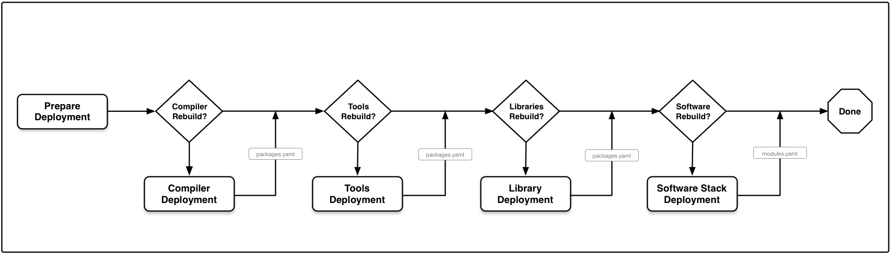

### SpackD : Deploying Software Stack with Spack

This is work-in-progress instructions for deploying softwrae stack with Spack.

###### CREDIT : Based on [spack-packagelist](https://github.com/epfl-scitas/spack-packagelist)

#### Setup Environment

Clone repository :

```
git clone https://github.com/pramodk/spack-deploy.git
cd spack-deploy
```

Setup virtual environment :

```
SPACKD_VIRTUALENV_PATH=`pwd`/spackd-venv
virtualenv -p $(which python) ${SPACKD_VIRTUALENV_PATH} --clear
. ${SPACKD_VIRTUALENV_PATH}/bin/activate
pip install --force-reinstall -U .
```

And you should have `spackd` available :

```
→ spackd --help

Usage: spackd [OPTIONS] COMMAND [ARGS]...

  This command helps with common tasks needed to deploy software stack with
  Spack in continuous integration pipeline

Options:
  --input FILENAME  YAML file containing the specification for a production
                    environment
  --help            Show this message and exit.

Commands:
  compilers  Dumps the list of compilers needed by a...
  packages   List all the packages that are part of an...
  stack      List all the providers for a given target.
  targets    Dumps the list of targets that are available
```


> On OSX I saw :
>
> ```
>   Could not fetch URL https://pypi.python.org/simple/click/: There was a problem confirming the ssl certificate: [SSL: TLSV1_ALERT_PROTOCOL_VERSION] tlsv1 alert protocol version (_ssl.c:590) - skipping
> ```
> See [this](https://stackoverflow.com/questions/49743961/cannot-upgrade-pip-9-0-1-to-9-0-3-requirement-already-satisfied/49758204#49758204) : from virtual env do:
>
> ```
> curl https://bootstrap.pypa.io/get-pip.py | python
> ```

#### Toolchain Specifications

The compiler toolchain specification is based on multiple axis:

```
axis:
  - architecture
  - compiler
  - mpi
  - lapack
  - python
```

These axis represent how the hierarchical modules (e.g. with LMOD) are exposed to end users. For example :

* two compute architectures are available : linux-rhel7-x86\_64 and darwin-sierra-x86\_64
* multiple compilers are available for each architecture : gnu, intel, llvm
* each compiler has multiple mpi libraries : hpe-mpi, mvapich2
* each mpi could provide multiple lapack libraries : intel-mkl, netlib-lapack
* different python versions could be used for compiling package : python@2.7.16, python@3.6.5


We define compiler toolchains in [packages/compiler-toolchains.yaml](packages/compiler-toolchains.yaml) as:


```yaml
core:
  architecture:
  - x86_64
  - x86_64_knl
  compiler:
  - gcc@4.8.5
  - gcc@4.8.5
  mpi: None
  lapack: None
  python: None

# stable gnu toolchain
gnu-stable:
  architecture:
  - x86_64
  - x86_64
  compiler:
  - gcc@6.4.0
  - gcc@6.4.0
  mpi:
  - hpe-mpi@2.16
  - mvapich2@2.3 process_managers=slurm fabrics=mrail file_systems=gpfs threads=multiple
  lapack:
  - openblas@0.2.20
  - openblas@0.2.20
  python:
  - python@3.6.5
  - python@2.7.15
```

The `core` toolchain typically represent system compiler. This compiler is used only to bootstrap/install other compilers and some basic utility packages. And hence it doesn't provide any mpi, lapack or python packages.

The next toolchain `gnu-stable` represent default GNU compiler. We are going to provide two mpi libraries and two python versions. Note that the length of each axis should be same (and hence there are duplicate entries).


#### Packages Specifications

Once compiler toolchains are defined, we can define packages to build for each toolchain as:


```
packages:
  compilers:
    target_matrix:
      - core
    requires:
      - architecture
      - compiler
    specs:
      - gcc@8.2.0
      - gcc@7.3.0
      - gcc@6.4.0
      - gcc@5.5.0
      - intel-parallel-studio+advisor+clck+daal+gdb+inspector+ipp+itac+mkl+mpi+rpath+shared+tbb+vtune@cluster.2018.3
      - intel-parallel-studio+advisor+clck+daal+gdb+inspector+ipp+itac+mkl+mpi+rpath+shared+tbb+vtune@cluster.2017.7
      - intel@18.0.3
      - intel@17.0.7
      - llvm@6.0.1
      - llvm@5.0.1
      - pgi+network+nvidia+mpi@18.4
      - pgi+network+nvidia+mpi@17.10
```

Here is brief summary of what's going on:

* `compilers` here is a just tag
* `target_matrix` indicates which compiler toolchain we are going to use (see Toolchain Specifications)
* `requires` indicates which axis will be used while building the packages
* `specs` indicates which packages we are going to build

It would be more clear if we look at the package specs generated with `spackd` command.

To see which packages will be installed, for example, to install all compilers on the system:

```
→ spackd --input packages/compiler-packages.yaml packages x86_64

gcc@8.2.0 %gcc@4.8.5 target=x86_64
gcc@7.3.0 %gcc@4.8.5 target=x86_64
gcc@6.4.0 %gcc@4.8.5 target=x86_64
gcc@5.5.0 %gcc@4.8.5 target=x86_64
intel-parallel-studio+advisor+clck+daal+gdb+inspector+ipp+itac+mkl+mpi+rpath+shared+tbb+vtune@cluster.2018.3 %gcc@4.8.5 target=x86_64
intel-parallel-studio+advisor+clck+daal+gdb+inspector+ipp+itac+mkl+mpi+rpath+shared+tbb+vtune@cluster.2017.7 %gcc@4.8.5 target=x86_64
intel@18.0.3 %gcc@4.8.5 target=x86_64
intel@17.0.7 %gcc@4.8.5 target=x86_64
llvm@6.0.1 %gcc@4.8.5 target=x86_64
llvm@5.0.1 %gcc@4.8.5 target=x86_64
pgi+network+nvidia+mpi@18.4 %gcc@4.8.5 target=x86_64
pgi+network+nvidia+mpi@17.10 %gcc@4.8.5 target=x86_64
```

These specs can be the used to install packages using `spack install` command. This become more useful when multiple compilers and mpi libraries come into picture, for example, to install all parallel libraries on the system :

```
→ spackd --input packages/parallel-libraries.yaml packages x86_64

hdf5+mpi@1.10.2 ^hpe-mpi@2.16 %clang@6.0.1 target=x86_64
omega-h@9.17.2 ^hpe-mpi@2.16 %clang@6.0.1 target=x86_64
...
hdf5+mpi@1.10.2 ^hpe-mpi@2.16 %intel@18.0.1 target=x86_64
omega-h@9.17.2 ^hpe-mpi@2.16 %intel@18.0.1 target=x86_64
...
hdf5+mpi@1.10.2 ^hpe-mpi@2.16 %gcc@6.4.0 target=x86_64
omega-h@9.17.2 ^hpe-mpi@2.16 %gcc@6.4.0 target=x86_64
...
hdf5+mpi@1.10.2 ^mvapich2@2.3 process_managers=slurm fabrics=mrail file_systems=gpfs threads=multiple %gcc@6.4.0 target=x86_64
omega-h@9.17.2 ^mvapich2@2.3 process_managers=slurm fabrics=mrail file_systems=gpfs threads=multiple %gcc@6.4.0 target=x86_64
....
```

Similarly, packages for `x86_64_knl` target can be generated with :

```
 → spackd --input packages/parallel-libraries.yaml packages x86_64_knl

hdf5+mpi@1.10.2 ^hpe-mpi@2.16 %intel@18.0.1 target=x86_64_knl
omega-h@9.17.2 ^hpe-mpi@2.16 %intel@18.0.1 target=x86_64_knl
petsc+int64+mpi@3.9.3 ^hpe-mpi@2.16 %intel@18.0.1 target=x86_64_knl
trilinos+kokkos+teuchos@12.12.1 ^hpe-mpi@2.16 %intel@18.0.1 target=x86_64_knl
```

The specs become complicated but they are complete considering architecture, compiler and mpi dependecies.


#### Whole Software Stack

Here is list of all packages (in order) that we will be installing :

```
spackd --input packages/compiler-packages.yaml packages x86_64 --output compiler-packages.txt
spackd --input packages/build-dep-packages.yaml packages x86_64 --output buiild-dep-packages.txt
spackd --input packages/serial-libraries.yaml packages x86_64 --output serial-libraries.txt
spackd --input packages/python-packages.yaml packages x86_64 --output python-packages.txt
spackd --input packages/parallel-libraries.yaml packages x86_64 --output parallel-libraries.txt
```
Similarly for target `x86_64_knl`.

#### Todo : Deployment Workflow

Here is how deployment workflow should look like :



#### Todo : Jenkins Pipeline Workflow

See exisiting scripts in `scripts/` directory and `Jenkinsfile`. Those should be refactored for new workflow.

#### Other Commands

```
→ spackd --input packages/parallel-libraries.yaml targets
x86_64

→ spackd --input packages/parallel-libraries.yaml compilers x86_64
clang@6.0.1%gcc@4.8.5 target=x86_64
gcc@6.4.0%gcc@4.8.5 target=x86_64
intel@18.0.1%gcc@4.8.5 target=x86_64
intel@18.0.1-knl%gcc@4.8.5 target=x86_64
pgi@18.4%gcc@4.8.5 target=x86_64
```
